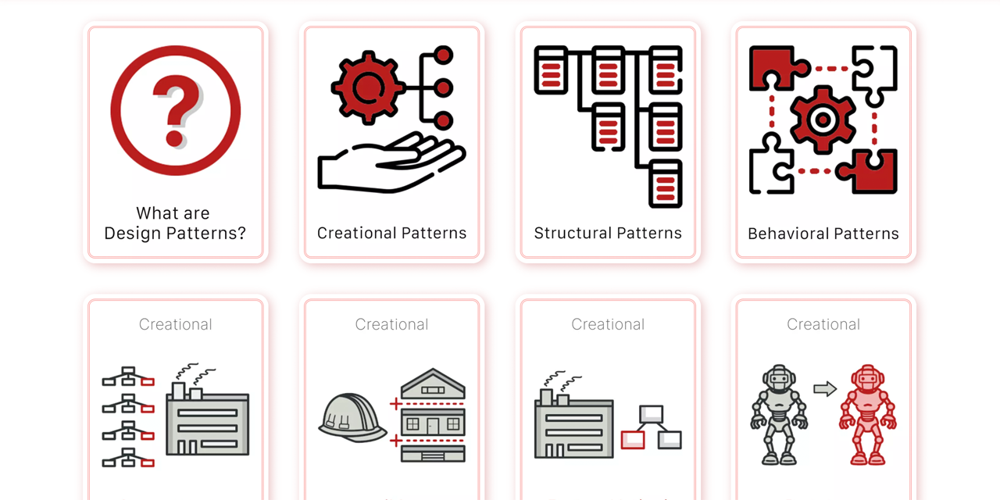

<p id="header"><p>

<table><tr>
<td> <a href="https://github.com/emjose/js-notes-app/#header"></a> </td>
<td> <a href="https://github.com/emjose/one-hundred/#header"></a> </td>
<td> <a href="https://github.com/emjose/design-patterns-101/#header"></a> </td>

</tr></table>

<br>

<p id="project-title"><p>

<a href=#table-of-contents></a>

<br>

<a href="https://design-patterns-101.vercel.app/"></a>

#

<p id="table-of-contents"><p>

<a href=#table-of-contents></a>

-   [100 Days of Code](#100days)
-   [Installation](#installation)
-   [Live Site](#live-site)
-   [Resources](#resources)
-   [Copyright](#copyright)
-   [Let's Connect!](#lets-connect)

#

<p id="100days"><p>

<a href=#100days></a>

### Day 33: February 1, 2022

-   To begin learning about design patterns, I made flip cards by adapting my <a href="https://agile-101.vercel.app/">Agile 101 project</a>.

-   Design patterns are general solutions to commonly occurring problems in software design.

-   Design patterns can be described as reusable and customizable blueprints or templates.

-   The flip cards feature the 23 design patterns first described in the book:

    <a href="http://www.javier8a.com/itc/bd1/articulo.pdf">**_Design Patterns: Elements of Reusable Object-Oriented Software_**</a> (1994)

    by Erich Gamma, Richard Helm, Ralph Johnson, and John Vlissides (known as the the **Gang of Four**)

-   The material and art are from <a href="https://refactoring.guru/">Refactoring.Guru</a> and <a href="https://zhart.us/">Dmitry Zhart</a>. Images formatted with Adobe Photoshop.

#

<p id="installation"><p>

<a href=#installation></a>

#### Git clone and cd into the repo folder:

```
git clone git@github.com:emjose/design-patterns-101.git && cd design-patterns-101
```

#### Run the command:

```
open index.html
```

#

<p id="live-site"><p>

<a href="https://design-patterns-101.vercel.app/"></a>

<a href="https://design-patterns-101.vercel.app/"></a>

• Design Patterns 101 is keyboard accessible, and a mouse hover will flip a card over.

• Pressing the tab key (or a mouse click) will **pause** a selected card in its flipped state.

• A tab key press or a mouse click **outside** of the flipped card reverts that card to its original state.

• On a touchscreen device: tapping another card will flip the previously selected card back to its initial state.

#

<p id="resources"><p>

<a href=#resources></a>

-   #### [Creating a Card Flip by Dong Xia](https://dong-xia.medium.com/creating-a-card-flip-i-challenge-you-to-a-duel-4e4e124c5060)

-   #### [How TO - Flip Card](https://www.w3schools.com/howto/howto_css_flip_card.asp)

-   #### [Flaticon](https://www.flaticon.com/)

-   #### [Adobe Photoshop](https://www.adobe.com/products/photoshop/free-trial-download.html)

-   #### [Interpreter Design Pattern](https://sourcemaking.com/design_patterns/interpreter)

-   #### [JavaScript Design Patterns](https://www.dofactory.com/javascript/design-patterns)

-   #### [Design Patterns: Notes by Ray Toal](https://cs.lmu.edu/~ray/notes/designpatterns/)

-   #### [Design Patterns JS](https://github.com/fbeline/design-patterns-JS) by [Felipe Beline](https://github.com/fbeline)

-   #### [Gang of Four (GoF) Design Patterns](https://www.journaldev.com/31902/gangs-of-four-gof-design-patterns)

-   #### [Learning JavaScript Design Patterns](https://www.patterns.dev/posts/classic-design-patterns/)

-   #### [PDF - _Design Patterns: Elements of Reusable Object-Oriented Software_](http://www.javier8a.com/itc/bd1/articulo.pdf)

-   #### [My blog on how I created my Github READMEs](https://emmanueljose.medium.com/readme-a-makeover-story-b9c7be37a6de?sk=7ae6623d365409d875753e4604e42ffd)

#

<p id="copyright"><p>

<a href=#copyright></a>

-   This project is for made for educational purposes only.
-   Material copyright of © <a href="https://refactoring.guru/">Refactoring.Guru</a>. All Rights Reserved.
-   Art copyright of © <a href="https://zhart.us/">Dmitry Zhart</a>. All Rights Reserved.

#

<p id="lets-connect"><p>

<a href=#lets-connect></a>

<p><a href="https://twitter.com/Emmanuel_Labor"> <a href="https://www.linkedin.com/in/emmanuelpjose/"> <a href="https://emmanueljose.medium.com/"> <a href="https://www.instagram.com/emmanuel_jose/"> <a href="mailto:emjose@gmail.com"> <a href="https://www.emmanuel-jose.com/"> <a href="https://github.com/emjose"></p>

#

<a href=#header></a>
